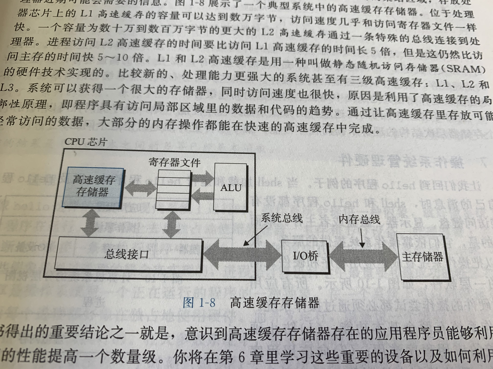
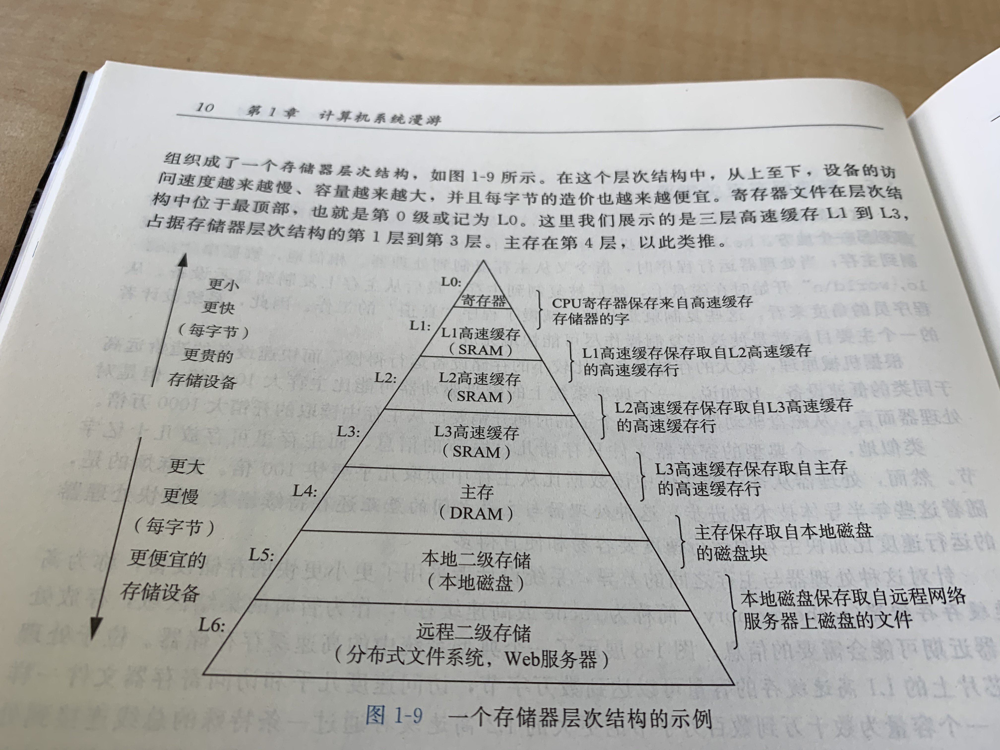

# 计算机系统简述

# 1.1 HelloWorld的执行过程

在gcc环境下，一个.c程序被顺利执行经过了以下几个过程：

* 预处理阶段： hello.c -> hello.i 预处理器根据#开头的命令修改源程序，对于#include<stdio.h>，预处理器就读取stdio.h的文件内容，并把它插入到程序文本，
这样就得到了下一个以.i结尾的c程序。

* 编译阶段：   hello.i -> hello.s 编译器将文本文件hello.i翻译为文本文件hello.s，它是一个汇编程序。

* 汇编阶段：   接下来汇编器就将汇编语言生成为机器指令，生成hello.o文件。

* 链接阶段：   程序中可能调用printf()，hello程序这时候就会寻找printf.o程序，并且让链接器合并。

# 1.2 系统的硬件组成

计算机系统主要由以下几个部分组成：

* 总线：贯穿整个系统的是一组电子管道，称为总线，它携带信息字节并且负责在各个部件通信。总线通常传送定长的字节块，也就是字。对于64位总线，1字就是8个字节。

* IO设备：IO是系统与外部联系的通道，键盘鼠标等就是就是IO设备。IO设备由设备控制器或者适配器和总线连接，它们的功能是在IO总线和IO设备传输信息。

* 主存：主存就是一个临时存储设备，用来存放运行时的程序或者程序处理的数据。从逻辑上来说，主存就是一个线性的字节数组，每个字节有唯一索引。

* 处理器：解释存储在主存中的指令的引擎，核心是一个字的存储设备（PC）。每个CPU在指令的要求下可能做下面这些操作。

    * 加载：从主存复制一个字到寄存器，覆盖寄存器原来的内容。
    
    * 存储：从寄存器复制一个字或者一个字节到主存。
    
    * 操作：把两个寄存器的数据复制到ALU（运算器）。ALU对两个寄存器的信息进行算术运算，并将结果返回到一个寄存器中。
    
    * 跳转：从指令中提取一个字，并将这个字的内容刷新到PC。
    
# 1.3 高速缓存

系统会花费大量时间把信息从一个地方移送到另一个地方。hello程序的机器指令最初在磁盘上，然后在程序被加载时被复制到内存上，处理器执行程序时，指令又从主存复制到寄存器。

这些复制就是开销，减少这些开销就能提高系统性能。根据机械原理，大的存储设备比小的存储设备要运行得慢，高速存储设备的造价远远高于低速设备。CPU从内存读取的速度是从磁盘读取速度的数万倍。

针对这种处理器和内存以及内存和磁盘之间的差异，系统设计者采用了更快更小的存储设备，称为高速缓存存储器（cache memory），作为暂时的集结区域，存放处理器近期可能会使用的信息。

下面是一个典型的高速缓存存储器。位于处理器芯片上的L1cache容量可以达到数万字节，访问速度几乎和寄存器文件一样快。一个容量为数百万字节的L2cache通过一条特殊的总线和处理器连接，L2仍然要比内存读取速度快。

L1和L2采用一种叫做静态随机访问存储器的硬件技术实现。一些系统还实现了L3cache。cache的原理是利用了局部性原则，程序具有访问局部性区域里的数据和代码的趋势，通过让cache存放经常访问的数据，大部分的内存操作都能在cache内完成。

# 1.4 存储器的层次结构

存储器层次结构的主要思想就是上一层的存储器作为低一层存储器的高速缓存。

# 1.5 操作系统管理硬件

程序运行时并没有直接访问键盘，磁盘或者内存。取而代之，他们需要依赖操作系统来实现。操作系统就是应用程序和硬件之间的一层交汇软件，所有程序对硬件的操作都必须通过操作系统。

操作系统有两个基本功能：

* 防止硬件被失控的程序滥用

* 向应用程序提供简单一致的机制来控制各种不同的硬件设备

操作系统通过几个抽象概念（进程，虚拟内存和文件）来实现这两个功能。文件是对IO设备的抽象表示，虚拟内存是对主存和磁盘IO的抽象表示，进程时对处理器、主存和IO设备的抽象表示。

# 1.5.1 进程

程序在运行时看上去在独占CPU、内存和IO设备，这种假象是通过进程的概念来实现的。实际上，一个系统可以同时运行多个进程，一个进程就是一个正在运行的程序。

并发执行，就是一个进程的指令和另一个进程的指令交错执行。在大多数系统中，需要运行的进程数是可以多于CPu个数的。传统系统同一时刻只能运行一个程序，而多核处理器可以同时处理多个程序，但无论如何，一个CPU都是可以并发执行进程的。操作系统实现这种交错执行的机制就成为上下文切换。

操作系统通过PCB（进程控制块）来跟踪进程，并且描述进程的状态信息。这些状态信息称为上下文。上下文切换就是把CPU控制权从一个进程移送到另一个进程需要做的工作。

上下文切换是由操作系统内核管理的，内核是操作系统常驻内存的部分。当应用程序需要执行某些操作，它就执行一条特殊的系统调用指令，并将控制权转移给内核。内核不是一个独立的进程，而是操作系统管理的全部进程所用代码和数据结构的集合。

# 1.5.2 线程

现代操作系统中，一个进程可以由多个称为线程的执行单元组成，每个线程都运行在进程的上下文中，并且共享全部的数据和代码。

# 1.5.3 虚拟内存

虚拟内存为每个进程都提供了一个假象，即每个进程都在独占使用内存。每个进程看到的内存都是一致的，称为虚拟内存地址空间。

下图为linux系统的虚拟内存地址空间，地址空间最上面是保留给操作系统中的代码和数据的，这对所有进程都一样。地址空间底部存放用户进程定义的代码和数据。

从最低的地址开始介绍：

* 程序代码和数据：对所有进程来说，代码是从同一地址出发，紧接着的是和C全局变量相对应的数据位置。

* 堆：代码和数据区后紧接着运行时堆。代码和数据区在进程一开始运行时就被指定了大小，与此不同，当调用像malloc和free这样的函数时，堆可以动态扩展和收缩。

* 共享库：存放C标准库和共享库。

* 栈：位于用户可用虚拟地址顶部，编译器用来实现函数调用。

* 内核虚拟内存：必须通过内核来调用的操作。

# 1.5.4 文件

文件就是字节序列，每个IO设备都可以看做文件。而所有的输入输出都是通过一小组Unix系统函数读写文件来实现的。

# 1.6 并发和并行

