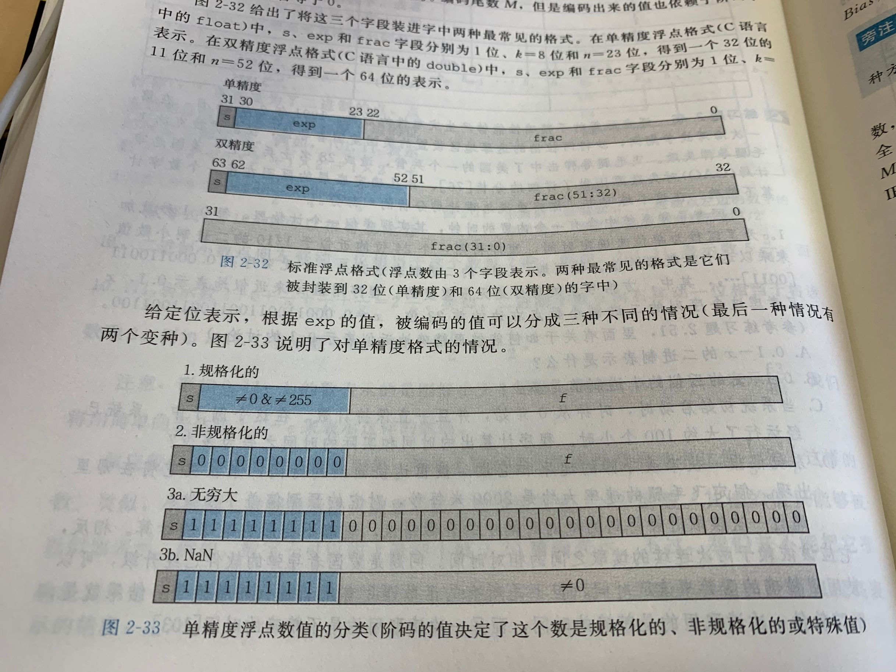

# 信息的表示和处理

对于计算机来说，有无符号、补码以及浮点数三种常用的表示方式，每种表示法实际都是有限的位组合起来表示一个数字编码。当结果太大，就会产生溢出。

# 2.1 寻址方式和字节顺序

几乎在所有机器上，多字节对象都被存储为连续的字节序列，对象的地址就是所使用字节的最小地址。例如，一个4字节的int地址为0x100，而实际上它占用了
0x100，0x101，0x102，0x103这四个地址。

排列一个字节序列通常有两种方法，一种是把高位字节放在内存地址低的地方，称为小端对齐；另外一种方式把高位字节放在内存地址高的地方，称为大端对齐。

大部分Intel机都实现小端对齐。

# 2.2 布尔代数

考虑长度为w（w > 0）的位向量，当w = 1时，只有两个元素；而更普遍情况下，有2 ** w 个元素。

整数运算的一个属性是每一个值x都有以后加法逆元 -x，使得x + -x = 0。对于位运算来说，这里的加法就是异或 ^ ，x ^ x = 0。
 
```java
public void swap(int x, int y) {
    y = x ^ y;
    x = x ^ y;
    y = x ^ y;
}
```

上面的代码是用异或来交换两个数的值：

y = x ^ y

x = x ^ x ^ y = y

y = y ^ x ^ y = x

# 2.3 移位运算

对于一个位长为w的位向量x，x << k 表示左移了k位，也就是向左丢弃k位，并在最低位补k个0。

而对于右移来说，有算术右移和逻辑右移两种。算术右移在左端补k个最高位的值，逻辑右移补k个0。

对于k >= w的时候会发生什么呢？

在很多机器上，移位运算实际上是通过计算 k mod w得到的，例如，当 k = 32时，移位次数实际是0。

# 2.4 整数

### 2.4.1 无符号数加法

对于w位的无符号数字 x 和 y， 满足 X >= 0， Y < 2 ** W。x 和 y 的无符号加法就是截断为w位得到的结果，再把这个结果看做一个无符号数。这可以看作一种形势的模运算，对 x + y的位级表示来说，x和y都丢弃第 w 位就可以计算出 x + y mod 2 ** w的结果了。

例如，1001 + 1100 mod 2 ** 4 = 001 + 100。

当 x + y 的结果 >= 2 ** w 时，就发生了溢出。对于无符号数， s = x + y， 当 s < x || s < y 时，就可以断定发生了溢出。

无符号数x的逆元： 2 ** w - x 

2 ** w - x + x = 0

### 2.4.2 补码加法

对于位长为w的补码 x 和 y， - 2 ** (w - 1) <= x, y <= 2 ** (w - 1) - 1,它们的加法和范围在 [-2 ** w, 2 ** w - 2]之间，要想精确表示，需要 w + 1 位。
我们通过截断到 w 位来防止数据的无线扩张，当 s = x + y 大于 Tmax（2 ** （w - 1）- 1），就需要减去 2 ** w，我们说发生了正溢出；相反，就称为发生了负溢出。


对于补码来说，只有同号会发生溢出。而当且仅当， s < 0 且 x > 0 ，y > 0 发生正溢出；s > 0 且 x < 0, y < 0 发生了负溢出。

对于补码加法来说，Tmin的逆元就是自己，其他所有数 x 的逆元是 -x。

补码计算方法：对于补码10110，可以看作是 -16 + 4 + 2 = -10。

### 2.4.3 无符号数乘法

对于位长为w的无符号数 x 和 y， 乘积 x * y 的范围在[0， （2 ** w -1）** 2]  = [0, 2 ** 2w - w ** （w + 1） + 1]之间，需要 2w 位长来表示。无符号数乘法的结果同样是截断 w 位的无符号数， 也就是2w的低位表示的值。。

无符号数的乘法 x * y = (x * y) mod 2 ** w。

### 2.4.4 补码乘法

对于位长为w的无符号数 x 和 y， 乘积 x * y 的范围在[-2 ** (2w - 2) + 2 ** (w-1), 2 ** (2w - 2)]之间，补码表示需要2w位。


### 2.4.5 乘以常数

乘法指令往往需要多个时钟周期，相比较加法和位运算，效率较低。

因此，许多编译器都尝试以移位、加法等组合来消除乘法操作。例如计算表达式 x * 14，编译器会将乘法重写为 (X << 3) + (X << 2) + (X << 1),更好的情况下，
我们可以使用 （X << 4） - （x << 1)。

### 2.4.6 除以2的幂

整数除法是比乘法更慢的操作，往往需要30个时钟周期以上。对于除法来说，也可以使用位操作进行优化。

对于无符号数来说，除以2的m次幂，只需要进行逻辑右移m次就可以得到结果。

对于补码来说，我们要保证符号一致，因此采用算术右移。

当需要结果保留为整数时，可能会出现一些问题。

-7 >> 1 = -4

7 >> 1 = 3

这时因为在舍入的时候，x / y，x 和 y 同号向0舍入，异号向下舍入。

因此，需要引入偏置量（biasing）。

对于异号的情况，我们写为 (X + (1 << K) - 1) >> K。


# 2.5 浮点数


### 2.5.1 二进制小数

计算机仍然用位向量来表示浮点数，以 . 来界限，左边的位的权是2的正幂，右边的权是2的负幂。

101.11 就表示为 4 + 0 + 1 + 1/2 + 1/4。

二进制小数点向左移动一位相当于这个数被2整除，向右移动相当于乘以2。

二进制无法精确表示1/3，5/7这样的数。二进制表示法只能表示那些被写为x * 2 ** y 的数，增加二进制的位数可以提高表示的精度。

### 2.5.2 IEEE754

IEEE浮点标准使用：

  V = (-1) ** s * M * 2 ** E 
  
来表示一个浮点数。

* s：符号，决定正负

* M：尾数，是一个二进制小数，[1, 2)

* E：阶数，对浮点数加权，权重是2 ** E

32位浮点表示中，划分为1位符号位sign，8位阶码exp,23位尾数frac。

64位浮点表示中，划分为1位符号位，11位阶码，52位尾数。

对于IEEE浮点表示的阶码exp可以把浮点数划分为三种情况（针对32位浮点）：




* 规格化的值：当exp不全为0也不全为1的时候，阶码的值是E = e - Bias，e是阶码位向量表示的无符号数，Bias是一个等于2 **（k - 1）- 1的值，k为阶码字段长度（Bias单精度为127，双精度为1023），因此，产生的指数E对于单精度是[-126， 127]，对于双精度是[-1022， 1023]
    小数字段frac被解释为小数值f，f范围为[0, 1).尾数定义为 M = 1 + f。
    
* 非规格化的值：当阶码位向量表示的无符号数全为0，就是非规格化数。在这种情况下，阶码值为 E = 1 - Bias，尾数的值 M = f, 也就是小数字段的值。并不加1。
    非规格化值用来表示0值，还可以表示那些非常接近0的数。
    
* 特殊值：当阶码全1，但小数位全为0时，得到的值是无穷大。两个非常大的数相乘或者除以零，无穷大能够表示溢出的结果。而当小数不全为0时，用来表示NaN，比如sqrt（-1）。

### 2.5.3 舍入

对于浮点运算，很重要的一个问题就是舍入，也就是寻找最接近x的整数。当x != [(x - 1) + (x + 1)] / 2 时，四舍五入就可以解决问题，但是当 x 介于两者中间时，就需要进行鉴别了。

通常情况下，我们采用向偶数舍入，也就是保证浮点数的最低有效位是偶数。对于1.5，向偶数舍入为2，对于-1.5，向偶数舍入为-2；而对于2.5，舍入为2。

### 2.5.4 浮点运算

对于浮点运算来说，不具有结合性。例如 (1e10 + 3.14) - 1e10 的结果是0，而 3.14 + （1E10 - 1E10）结果为3.14）（针对32位浮点数来说）。

大部分情况这无关紧要，但编译器无法在效率和可靠性之间取舍。考虑：

x = a + b + c

y = b + c + d

编译器可能通过产生下列代码省去一个运算：

t = b + c

x = a + t

y = t + d

这样，就可能产生误差。

# 2.6 类型转换

* int转float，不会溢出，但是会舍入。 当int的值大于2 ^(24)    (或小于-2 ^(24)  )时, 转换成float就有可能发生精度的丢失.

```java

        int v = (1 << 26) + 1;
        float f = (float)v;
        System.out.println(v);
        System.out.println(f);
```

* int、float转double，可以保证精度。

* double转float，可能出现溢出或者舍入。

* float、double转int，结果会向0舍入，也可能溢出。
