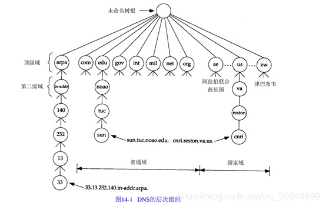

# 域名解析

# 11.1 引言

IP地址难以记忆，因此就需要主机名称来表示主机。为了使用TCP等协议，主机名称通过名称解析转换为IP地址。互联网最常见的名称解析系统是DNS，它是一种分布式数据库系统。

DNS是一个分布式的网络数据库。从应用程序来看，访问DNS是通过一个称为地址解析器的应用程序来完成的。通常，请求TCP打开一个连接或者使用UDP发送一个单播数据包之前，应用程序必须通过将主机名转换为IPV4地址。TCP和IP协议对DNS一无所知。

# 11.2 DNS名称空间

当前的DNS名称空间是一个域名树，位于顶部的树根没有被命名。树的最高层是顶级域名TLD，包括通用顶级域名gTLD，国家代码顶级域名ccTLD，国际化国家代码顶级域名IND CCTLD等。这些构成了一颗命名树的最高层。

### 11.2.1 DNS命名语法

DNS名称数下进一步细分，称为子域名。一个域名包括一系列的由点分开的标签，自右向左，层级下降。

www.BAIDU.COM

# 11.3 名称服务器和区域

DNS服务器中，管理授权的单位叫区域。一个区域是DNS名称空间的一颗子树，它可以独立管理而不受其他区域影响。

# 11.4 域名解析的过程

* 首先，会在浏览器和主机，以及路由器查找缓存。

* 如果缓存查找失败或者失效，那么本机地址解析器就会向本地域名服务器发送请求，并且将本地域名转换为IP地址。

* 如果本地域名服务器还查不到，那么就会转向ISP提供的服务器。

* ISP提供的服务器如果还查不到，就会联系根名称服务器的其中一台，根域名服务器返回需要联系的顶级域名服务器，ISP域名服务器利用这些信息，访问顶级域名服务器，顶级域名服务器查找到对应的目的域名服务器后，将结果返回给ISP提供的域名服务器。

# 11.5 UDP/TCP和DNS

对于TCP和UDP，DNS的端口是53。

DNS报文经过传输层和IP层封装，形成了IPV4数据报，并以IP数据报形式进行传输。

