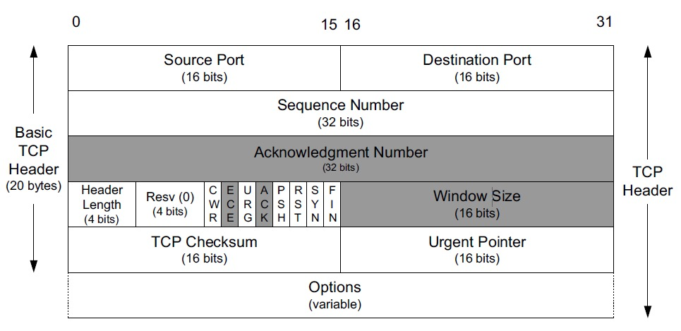

# TCP 传输控制协议

# 12.1 引言

对于IP和UDP，没有实现差错纠正，对于以太网或者其他协议，数据可能丢失或者被改变，对于这种情况，要么通过校验码避免出错，或者出错后也可以纠正。另外一种就是简单的重复发送，直到消息被正确接收。这种方法，称为ARQ（自动重复请求），构成了很多通信协议的基础。

### 12.1.1 ARQ和重传

实际上，除了分组的比特位出错，还有分组重新排序，分组丢失，分组重复等问题。

一个直接处理分组丢失的方法是，重发分组直到正确接收。这就需要一些手段加以判断：

    <1>接收方是否收到分组

    <2>接收方收到的分组是否和发出的分组一致

最基本的情况是，接收方给发送方发送一个确认信号ACK（acknowlegment），发送方等待接收接收方的ACK。发送方接收到后，再次发送。

这样会有一些问题，发送方对一个ACK应该等待多久，如果ACK丢失怎么办，当分组出错怎么办？

如果一个ACK丢失了，发送方就会重发原来分组，这样，接收方可能收到两个以上的拷贝。对于这种情况，使用序列号就可以解决。发送方发送数据时，每个分组都有一个唯一的标号，接收方可以使用这个序列号判断是否存在这个分组。

每次发送方发送完毕都等待ACK然后再重新发送下一个分组，这就是停止等待ARQ协议。

### 12.1.2 分组窗口和滑动窗口

为了实现能持续发送的能力，我们假设每个分组都有一个序列号开始，定义一个分组窗口作为发送方已经发送但是还没有确认的集合，窗口大小固定，每当窗口确认一个分组，窗口就移动一个单位。被移除的就是已经被确认的分组。这就是滑动窗口。

一般来说，滑动窗口在发送方和接收方都会保持。在发送方，它记录着哪些分组可以被释放，哪些分组正在等待ACK，哪些分组还不能发送。在接收方，它记录哪些分组已经被确认，哪些分组等待被确认，以及哪些窗口会被丢弃等。

### 12.1.3 流量控制和拥塞控制

为了处理当前接收方相对发送方接收速率太慢的问题，在接收方跟不上时会强迫发送方慢下来，这就是流量控制。一种是基于速率的流量控制，给发送方设定一个发送速率最大值，发送方发送速率不能超过这个阈值。另外一种就是基于窗口的流量控制，窗口大小不固定并随着时间变动。为了使用这种方法，必须有机制让接收方通知发送方
使用多大的窗口。

还应该考虑路由器有限的内存，发送方的发送能力可能超过某个路由器的接受能力，从而导致丢包，因此，还需要拥塞控制。

### 12.1.4 超时重传

# 12.2 TCP引入

TCP和UDP都基于IP层，但是TCP给应用程序提供了完全不同的服务。TCP面向连接，是一种可靠的字节流服务。面向连接，就是在交换数据之前，通过相互联系建立一个TCP连接。

TCP是可靠的。它提供了一个字节流接口，TCP必须把一个发送程序的字节流转换为IP可以携带的分组。这允许分组在传送过程中可变大小，并允许重新组包。由TCP传给IP的块称为报文段。

TCP还维持了一个强制的校验和，涉及它的头部，数据段和IP头部。一个带无效校验和的报文段会被丢弃。

当TCP发送一组报文段后，通常设置一个重传计时器，等待对方的确认接收。TCP不会为每个报文段都设置一个计时器，每发送一个窗口的数据，它只设置一个计时器，当ACK到达时再更新计时。如果有一个ACK没有及时收到，这个报文段就会被重传。

接收方收到数据后，会回送一个ACK。TCP的ACK是累积的，意味着之前所有的报文段都无误。

TCP提供了全双工的服务。

使用序列号，这使得TCP可以丢弃重复报文段，并且可以对乱序排序。TCP绝不会以杂乱的次序给应用程序接受数据，它会被迫保持大序列号的数据不被提交，直到比这个序列号小的报文段都被提交。

# 12.3 TCP头部和封装

TCP头部为20字节的固定长度和40字节的可选部分。

每个TCP头部都包括16位的源端口号和目的端口号。这两个值与IP头部中的源和目的IP地址一起，唯一表示一个TCP连接。一个IP地址和一个端口号通常称为一个socket或者端点。

序列号标识了TCP发送端到TCP接收端的一个字节，该字节为包含该字节报文的第一个字节。
