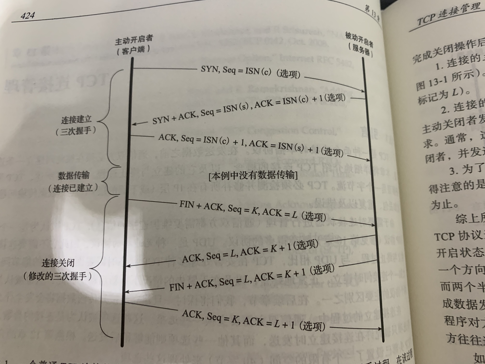

# TCP连接管理

# 13.1 TCP连接的建立和终止

一个TCP连接通常由三个阶段组成：启动，数据传输和退出。

    1.主动开启：发送一个SYN报文，头部的SYN置位，并指明自己想要连接的端口号和客户端的初始端口号ISN（c）。

    2.服务器回送一个SYN，并且包含它的初始序列号ISN（s）。此外，为了确认客户端的SYN，服务器将其包含的ISN（c）数值加1后作为返回的ACK值。因此，每发送一个SYN，序列号就加1，这样，如果重传，SYN就会重传。

    3.为了确认服务器的SYN，客户端将ISN（s）+1作为ACK值，返回。

上图还描述了如何关闭。TCP规定发送一个FIN来发起关闭操作，只有连接双方都完成关闭后，才构成一个完整的关闭操作。

    1.连接的主动关闭方发送一个FIN置位的报文指明希望看到自己当前的序列号。另外，这个数据报还包含对上一次接受的ACK。
    
    2.连接的被动关闭者将K+1作为相应的ACK值，表明它已经成功收到1报文。此时，上层的应用程序会被告知连接的另一端已经提出了关闭请求，通常，这导致应用程序发起自己的关闭操作。接着，被动关闭者将身份变为主动关闭者，并发送自己的FIN，序号为L。
    
    3.为了完整的关闭，最后发送的报文还包含一个ACK用来确认上一个FIN。如果出现FIN丢失的情况，那么发送方就需要重新传输直到接受到一个ACK确认。
    
# 13.2 半关闭

应用程序只需要调用shutdown（）来代替close（），就可以实现半关闭状态，通信的任何一方都可以实现。

# 13.3 同时打开和关闭

两个应用程序的ACK同时到达时可能发生的。例如，主机A的一个应用程序通过本地7777端口向主机B的8888端口发送一个主动打开请求，同时，B对A的请求也到达。在这种情况下，服务器始终是被动打开者而非主动打开者，也就是说，每个主机都扮演客户端和服务器端的角色，它们可以被区分为两个不同的TCP连接。

对于这种情况，只需要4次握手就可以实现而不是6次。两次TCP连接都没有最后一次的ACK。而关闭时，仍需要4次而不是8次。区别在于四次挥手是顺序的还是交叉的。

# 13.4 初始序列号

每一个TCP连接都有一个不同的初始序列号。初始序列号可以被看成一个32位的计数器，该计数器数值每4ms+1，如此，就解决了冲突的问题。但是如果这样实现，一次连接就容易被伪造，因为只要知道端点和序列号，就可以伪造出一个TCP报文段。而现在，大多对于序列号的产生会使用随机的方式产生。

# 13.5 TCP选项-最大段大小选项 MSS

最大段大小是TCP允许从对方接受的最大报文段的大小，MSS只记录TCP数据的字节数而不包括其他的头部数据。当建立一条TCP连接时，通信的每一方都要在SYN报文的MSS
选项声明中说明自己允许的MSS。这16位的选项在没有事先声明下，默认为536字节，也就是576-20-20.而在以太网中，MSS是1460字节，1500-20-20.当使用IPV6时，因为
IPV6头部为40字节，因此，这个数据为1440字节。

# 13.6 TIME WAIT 状态

TIME_WAIT也称为2MSL等待状态。在该状态中，TCP将等待2倍最大段生存期的时间。每个实现都必须为MSL明确一个数值，它代表着报文段在被丢弃前在网络中被允许存在的最长时间。
MSL和TTL共同限制了IP数据报的有效生存周期。MSL通常默认为2分钟，也可以自行设置为30s，1min等。

TCP连接的一端主动发起了FIN请求，并且发送了最终的ACK时就启动了2MSL的等待时间。这时，如果这个ACK丢失，那么被动关闭者就需要重发FIN请求，而这时，如果不设置2MSL的等待时间，就无法正常关闭TCP连接。
另外，考虑一种情况。当一方主动关闭，随后就重新连接时，这两个连接就无法被区分，而前一条TCP连接发送的报文段到达服务器后被认为是应该接受的，而实际上这已经是另外一个TCP连接了，这样，就造成了错误。

处于TIMEWAIT状态时，就不能以同样的TCP四元组再次建立连接。只有当2MSL结束后，这条TCP连接才能再次使用。

# 13.7 CLOSE WAIT 状态

这种状态的含义其实是表示在等待关闭。怎么理解呢？当对方close一个SOCKET后发送FIN报文给自己，系统毫无疑问地会回应一个ACK报文给对方，此时
则进入到CLOSE_WAIT状态。接下来呢，实际上你真正需要考虑的事情是察看你是否还有数据发送给对方，如果没有的话，那么你也就可以close这个SOCKET，
发送FIN报文给对方，也即关闭连接。所以你在CLOSE_WAIT状态下，需要完成的事情是等待你去关闭连接。

# 13.8 连接队列

服务器会为每一个客户端的连接请求都分配一个新的进程或者线程，而当多个连接请求同时到达呢。

首先应该知道，在被用于应用层之前新的连接可能处于两个状态。一种是连接尚未完成但是已经收到了SYN请求，另外一种是已经完成了三次握手，并且处于ESTABLISHED状态，但还没有被应用层接受。
因此，操作系统通常会使用两个队列来对应上面两个不同的情况。

对于Linux来说，当一个连接到达，将会键查net.IPV4.tcp_max_Syn_backlog（默认为1000）。如果处于Syn_RCVD状态(已经收到Syn，但是连接没有完成)的连接数量超过这一阈值，新的连接就被拒绝。

对于三次握手已经完成，但是没有被应用程序接受的任务，也有一个限制，通常是128。如果这个队列未满，TCP模块就应答SYN请求，完成三次握手。如果已满，TCP就会延迟对SYN的响应。

# 13.9 半开连接

如果在未告知对方的情况下突然断开连接，那么就认为TCP连接处于半开状态。这种情况发生在一方的主机崩溃的情况下。只要不尝试向半开连接传输数据，正常工作的另外一端不会检测到另外一台主机已经崩溃。

客户端大量处于半开连接状态，服务器端就会有很多无效的TCP连接占用端口。

假设服务器端处于半开连接，服务器重启恢复工作后，客户端向服务器端发送了数据，当数据传输到服务器端，服务器对此一无所知。所以上述操作会引起服务器端的重置响应。

# 13.10 时间等待错误

当客户端处于TIME_WAIT状态时，服务器端已经关闭了连接。而这时候，如果一条来自服务器端的消息到达了客户端，客户端因为处于TIME_WAIT状态，所以回送了ACK置位的报文，这时候服务器已经处于关闭状态会怎么回应呢？

服务器会回送一个RST作为响应。它会让客户端提前进入closed状态。许多系统也规定了处于TIME_WAIT的状态不会对重置报文作任何响应。
