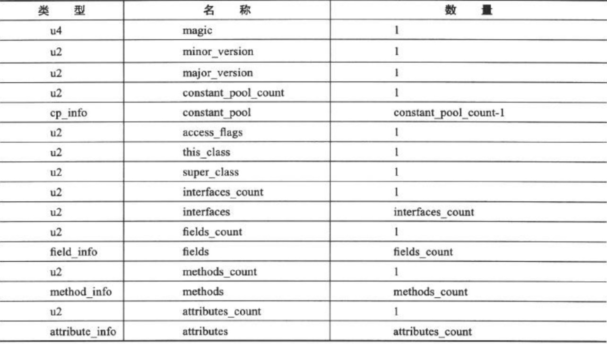

# class文件结构

# 6.1 概述

  class文件是一组以八字节为基础单位的二进制流。并且采用大端对齐的方法，当遇到需要八个字节以上的时候，将高位字节放置在地址最小位。
  
  class文件采用类结构体的数据结构存储数据，这种数据结构只包括无符号数和表。
  
  * 无符号数：以u1，u2，u4，u8来代表1个字节，2个字节，4个字节和8个字节。
  
  * 表：由无符号数和其他表构成。
  
# 6.2 魔数
  每个class文件前四个字节称为magic number。它的作用是作为一个class文件是否能被虚拟机接受的判断依据。
  
# 6.3 版本号

  紧接着四个字节存储版本号。前两个字节存储次版本号，之后两个字节存储主版本号。Java版本号从45开始，JDK1.1后每个版本号向上加1。 
  
# 6.4 常量池
  常量池可以比喻为class文件的资源仓库，是第一个出现表结构的项。
  
  由于常量池数量不固定，因此，常量池入口有两个字节的常量数，代表容量。这个数从1开始。比如22，就表示存储了21个常量。
  
  常量池存储了两类常量：
  * 字面量：接近Java语言层面，如字符串，被声明为final的变量。
  * 符号引用：接近编译原理层面，主要有
    * 被模板导出的包
    * 类和接口的全限定名
    * 字段的名称和描述符
    * 方法的名称和描述符
    * 方法句柄和方法类型
    * 动态调用点和动态常量
  
  Java在经过javac编译的时候，经历的是动态连接。也就是说，class文件不保存方法和字段在内存中的布局而只是保存其符号引用。这些符号引用不经
  过jvm运行时期转换是无法找到真正的内存入口的。当虚拟机做类加载时，将会从常量池获得对应的符号引用，再在类创建或者运行时解析，翻译成具体的内存地址。
  
  常量池的每一个常量都是一个表，表结构的共同点是第一个u1类型的标识位代笔了其类型信息。
  
  
# 6.5 访问标志
  常量池结束后，接着是2B的访问标志。用来识别一些接口和类的信息，包括这个class是类还是接口，是否是public，是否是abstract，是否是final，
  以及是否是注解，枚举等。
  
# 6.6 类索引，父类索引和接口索引

  类索引和父类索引都是2B的类型，也就是u2。接口索引是一组u2的集合。Class文件由这三个确定继承关系。类索引确定类的全限定名，父类索引确定继承，由于Java不允许多重继承，所以只允许有一个。除了Object，所有类都有父类。
  对应的索引指向签名所说的CONSTANT_Class_info，其值在对应的UTF8常量中。
  
  * 类索引:确定这个类的全限定名
  
  * 父类索引：确定这个类的父类的全限定名
  
  * 接口索引集合：描述这个类实现了哪些接口，并且，接口索引的第一项是u2的接口计数器，标识索引的容量，如果没有实现接口，就是0。
  
# 6.7 字段表集合
  字段表集合描述接口或者类中的变量。包括类级变量和实例级变量，但不包括方法中的局部变量。字段可以包含的信息有作用域（public，private等），是实例变量还是类变量等等。这些信息很适合用标识位描述。
  
  在字段表中，有一个access_flags存储字段的修饰符，比如public，private等。
  
  并且，从这可以知道，final和volatile是不能同时修饰的。
  
  对于基本类型：特殊的，对象类型用L表示，long类型用J表示，boolean用Z表示，其余都是字母首位。
  
  对于数组，每一维度都会使用一个前置[，java.string[][]表示为[[Ljava/lang/string; 
  
  字段表不会列出从父类或者接口继承的字段。
  
# 6.8 方法表集合
  和字段表类似。
  
  方法的定义可以通过方法表获取，但是方法里面的代码呢？
  
  方法里的代码在编译为字节码后，存放在一个名为Code的方法属性表属性里。
  
  若父类方法没有被重写，就不会出现在方法表中。
  
  在Java中，要重载一个方法，除了要和原来方法具有相同的简单名称，还必须有一个特征签名。特征签名是参数的字段引用集合，正因为特征签名没有
  返回值类型的引用，不可以通过返回值区别重载。
  
# 6.9 属性表集合
  字段表，class文件，方法表都可以携带自己的属性表。
  
  常见的属性有：
    
### 6.9.1 Code属性
  Java方法体经过编译后，变为字节码指令存储在code属性内。Code属性出现在方法表的属性集合之中，但不是所有的方法表都存在code属性，比如接口。
  
  code属性表中，常用的标识符有：
  
  * attribute_name_index：指向utf常量的索引，固定为"Code"，代表了该属性的名称。
  
  * max_stack：代表了操作数栈深度的最大值，虚拟机根据这个分配栈帧。
  
  * max_locals：代表了局部变量表所需的存储空间，单位是slot。一个slot为32位。
  
  * code_length和code：存储字节码。code_length代表字节码长度。每个字节码指令都是一个u1。Java一共可以使用256条指令。code_length被明确规定不允许超过65535条字节码指令。一般来讲，只要不特意编写一个特别长的方法，是不会超过这个范围的。
  
  Code属性是最重要的一个属性。如果把一个Java程序分为代码（方法体内的代码）和元数据（Metadata，类、字段和方法定义以及其他信息）两部分，那么整个class文件中，Code用来描述代码，所有其他属性用来描述元数据。
    
# 6.10 字节码指令简介

  Jvm的指令由一个字节长度的操作码和一定字节的操作数组成。
  
  常见的，对于synchronized，Jvm会通过moniterenter和moniterexit指令来解释其含义。
  编译器必须确保无论何种方式，方法中每条enter指令都有其对应的exit指令。  
  